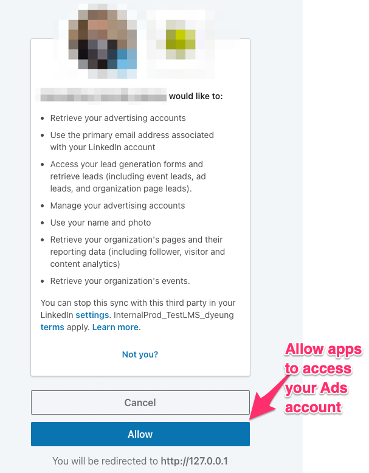
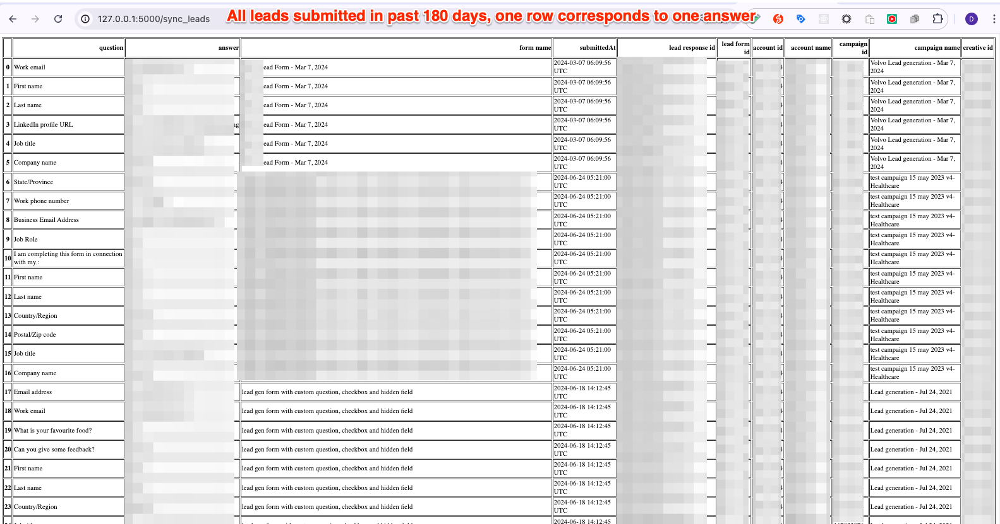

# LinkedIn Sample Lead Sync Apps (MVP)

## Introduction

This project sets up a basic Python Flask web application that allows users to log in using their LinkedIn accounts through OAuth 2.0, retrieves authenticated user data and download leads from LinkedIn.

It's meant to be a Minimum Viable Product (MVP) to validate a business idea with minimal resources and effort by releasing a basic version of the product that includes only the essential features.

Developer is welcome to build on top of it to add more functionality and polish the user experience, or integrating into existing workflow.

## Pre-requistie

1. Create an app from [LinkedIn developer portal](https://developer.linkedin.com)
2. Make sure the app have added the required product. If it doesn't please request access. 
3. Create [LinkedIn Ads account](https://www.linkedin.com/help/linkedin/answer/a426102/create-an-ad-account-in-campaign-manager-as-a-new-advertiser). Ads account should include test leads.
4. Assume all the above requirements are met, developer should be able to spin up a MVP apps in 5 minutes.

## How to run

1. Create virtual environment

   `python -m venv venv`

2. Activate virtual environment
   `source venv/bin/activate`

3. Install requirements
   `pip install -r requirements.txt`

4. Add client id, client secret, LinkedIn Ads account id in .env file.

5. Provision redirect_url (http://127.0.0.1:5000/login/authorized) in the apps under LinkedIn developer portal
   

6. Run flask app by
   `flask --app sample run`

7. Open Chrome web browser in incognito window at :
   `http://127.0.0.1:5000/`

The apps will print the current logged in user and lead responses in last 180 days of LinkedIn Ads account on console, and leads will be sent to browser.

## Limitations and Further Enhancements

1. To further enhance the apps, developer may persist the access token in the apps and implement token refresh routine
2. Developer may store the leads in database or sync to leads into CRM
3. Developer may implement the UI logic to sync leads with muliple Ads account
4. Developer may implement the UI logic to specifiy time period of leads sync and implement a scheduler to run the apps

## Troubleshooting

1. If developer run into api error, please clear all caches/cookies in current window or launch a new incognito window.
2. If developer find a bug, please submit new issue in github.

## MVP Screenshots

